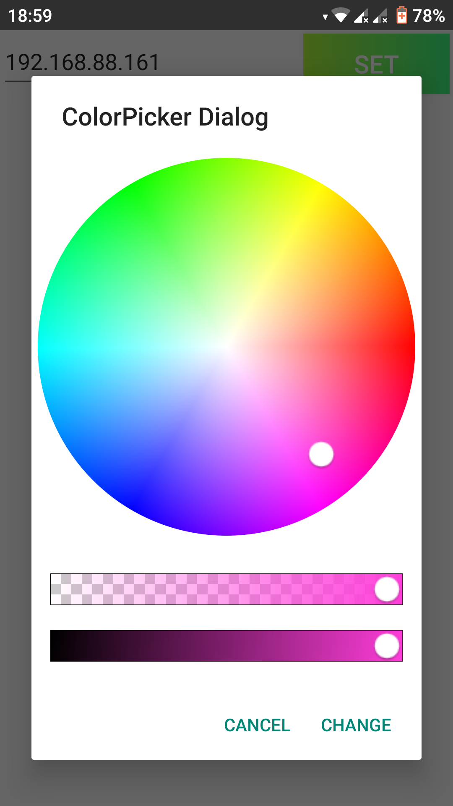

# Android app for controlling leds
## Functions
 - Power - turn on/of leds
 - Blue eye - turn on/off build in led
 - Single color - one color on all leds
 - Random - random color on each segment each 5 seconds
 - Random single - random color on all leds
 - Smooth - slowly changing color on each segment
 - Smooth single - slowly changing single color
 - Smooth half - slowly changing color on pairs of segments
## Views  
Main view  
  
Dialog color picker  
  
