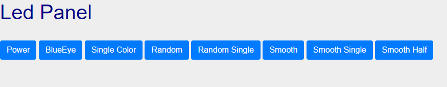
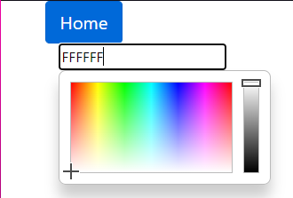
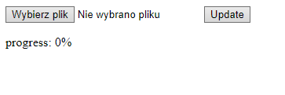

# Arduino Code to ESP32
## Features:  
 - Controlling leds through website
 - Software update via website
 - One core changes colors other handle http requests
## Endpoint  
Basic address: http://leds.local
 - /Power - turns leds on/off 
 - /BlueEye - turns build in led on/off
 - /SingleColor - http GET web page to set color on leds
 - /SingleColor/Get - http POST with rgb color to set on all leds
 - /Random - random color on each set of leds each 5 seconds
 - /RandomSingle - random color on all leds each 5 seconds
 - /Smooth - smooth changing colors on each set of leds. Each set has its own vector of changing colors
 - /SmoothSingle - smooth changing color on all leds.
 - /SmoothHalf - smooth changing colors on pairs of sets of leds.
 - /leds - http POST to set each set of leds
 - /serverIndex - website to update software
   
## Views:
Main page  
  
Single Color  
  
Software update  
  
