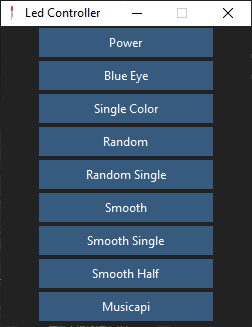

# Python app to controll leds
## Functions
 - Power - turn on/of leds
 - Blue eye - turn on/off build in led
 - Single color - one color on all leds
 - Random - random color on each segment each 5 seconds
 - Random single - random color on all leds
 - Smooth - slowly changing color on each segment
 - Smooth single - slowly changing single color
 - Smooth half - slowly changing color on pairs of segments
 - Musicapi - color changes with music
 ## View
  
 ## Music api
  - Use one octave to determine color
  - Use discrete Fourier Transform to determine power of color
  - Color changes from green to red acording to value from fft
  
