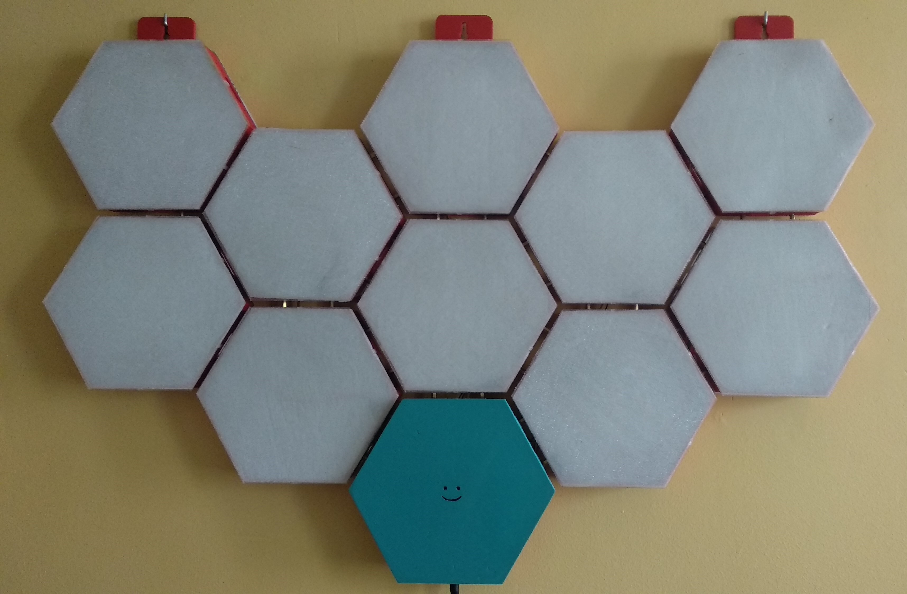
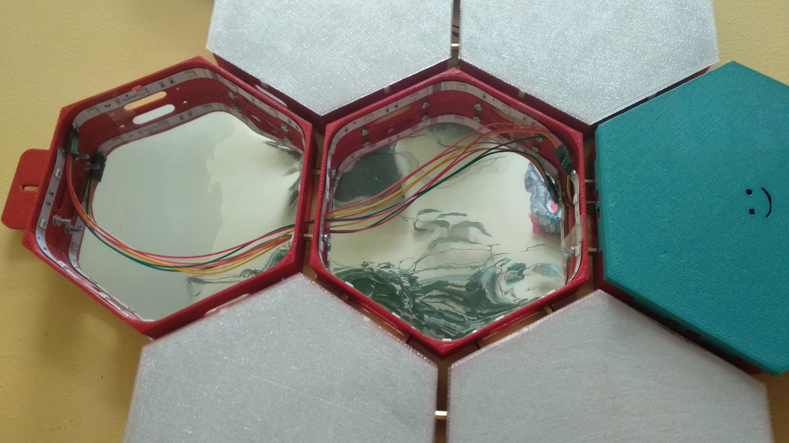
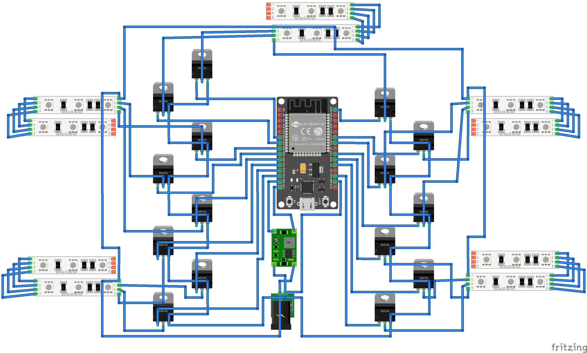
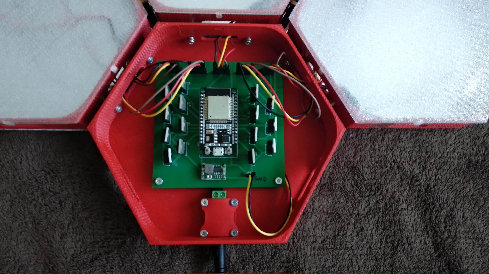
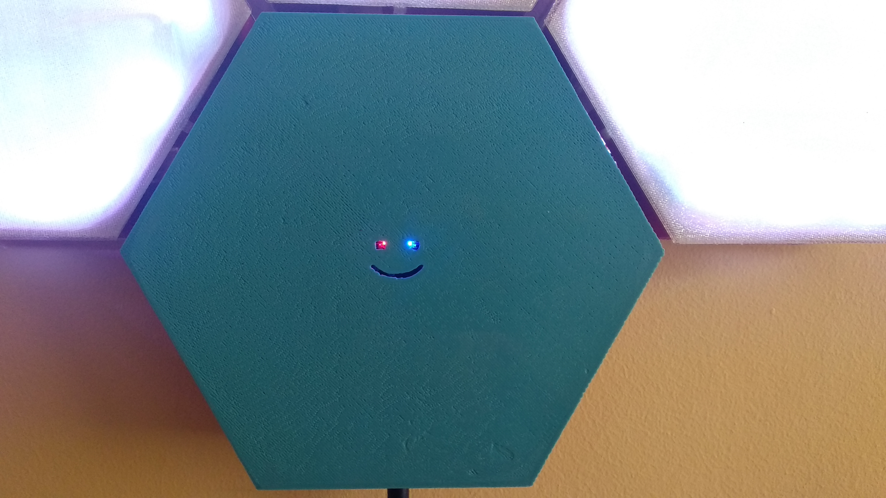

# DIY nanoleaf
## Case
All the <a href="3D model">parts</a> were 3D printed with pla and connected with 1 cm spacers.  
 
There is a reflective material glued on the back of the case.  
Cover was printed in 2 layers of translusend pla. Later I glued thin paper to cover so the light was more diffused.  
   
## Electronics
### Used:
 - Esp32 to controll leds
 - 5m RGB Led strip 12V devided in 10 segments for each hexagon
 - 15 N-Mosfets to controll 5 different colors through Esp32
 - Led power suppy
 - Mini 360 DC-DC step-down converter
  
### Diagram
   
  
### <a href="Board project">Board</a> 
   
  
## Programmed functionality
 - Turn on/off leds
 - Turn on/off build in led
 - Single color
 - Random color on each segment every 5 seconds
 - Single random color every 5 seconds
 - Smooth change on each segment color
 - Smooth change of single color
 - Smooth change of pairs of segments
 - Api to control each segment color. For exaplle changing color with music described in <a href="Pythonn App">Python app</a>  
   
   
